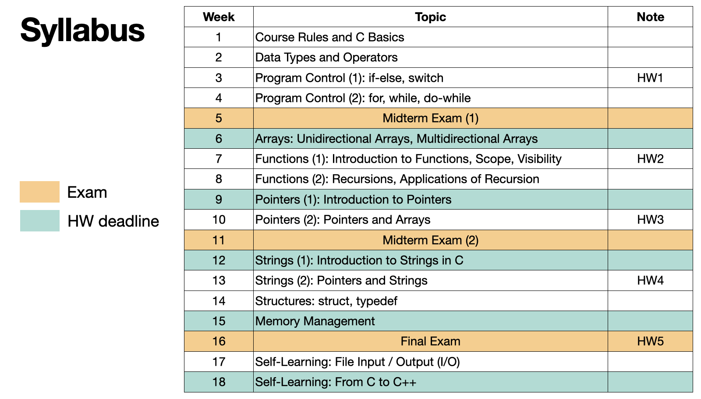

# C-course-materials
This repository is the course materials for *Computer Programming* at National Chung Hsing University, in the academic year 113.

## Course Information
| Week | Theme | Code | Slide | Quiz | Slido |
| -------- | -------- | --- | --- | --- | --- |
|1| 	Chapter 01: Course Rules and C Basics | [`Folder`](./01-basics) | [`Slide1`](./slides/intro.pdf) [`Slide2`](./slides/c_basics.pdf) [`SUP`](./slides/c_basics_sup.pdf)|
|2| 	Chapter 02: Data Types and Operators | [`Folder`](./02-data-types) | [`Slide`](./slides/data_types_op.pdf) [`SUP`](./slides/data_types_op_sup.pdf) | [`Quiz`](quizzes/w2.md) [`Ans`](quizzes/w2_ans.c) | [`Slido`](https://app.sli.do/event/2ZAKNJ9yG6sa6Gz6ZH7vkT) |
|3| 	Chapter 03: Program Control (1)| [`Folder`](./03-Program_control) | [`Slide`](./slides/control_1.pdf) | [`Quiz`](quizzes/w3.md) [`Ans`](quizzes/w3_ans.c) | [`Slido`](https://app.sli.do/event/f2mntYzC21o6hhzJJasQG5)  |
|4|     Chapter 03: Program Control (2)| [`Folder1`](./03-Program_control_for) [`Folder2`](./03-Program_control_while) | [`Slide`](slides/control_2.pdf) | [`Quiz`](quizzes/w4.md) [`Ans`](quizzes/w4_ans.c)  | [`Slido`](https://app.sli.do/event/5yDqn6bchhHwQnxQ9FfmK9) |
|5| 	Midterm Exam (1)
|6| 	Chapter 04: Arrays | [`Folder`](./04-Arrays) | [`Slide`](slides/arrays.pdf) | [`Quiz`](quizzes/w6.md) [`Ans`](quizzes/w6_ans.c)| [`Slido`](https://app.sli.do/event/sToe6xX3QcD3W8fwZ3qeZb) |
|7| 	Chapter 05: Functions (1) | [`Folder`](./05-Functions) | [`Slide`](slides/functions.pdf) | [`Quiz`](quizzes/w7.md)| [`Slido`](https://app.sli.do/event/wrU4JR9FC3rph3U5nNMqko) |
|8| 	Chapter 05: Functions (2) | [`Folder`](./05-Functions-2)  | [`Slide`](slides/functions_2.pdf) | [`Quiz`](quizzes/w8.md) | [`Slido`](https://app.sli.do/event/ko1Ax93b38CYuj79op15WL) |
|9|     Chapter 06: Pointers (1) | [`Folder`](./06-Pointers) | [`Slide`](slides/pointers.pdf) | [`Quiz`](quizzes/w9.md) [`Ans`](quizzes/w9_ans.c) | [`Slido`](https://app.sli.do/event/4BNCTBE5XgbJFZMjAbeZe2) |
|10| 	Chapter 06: Pointers (2) | [`Folder`](./06-Pointers-arrays) | [`Slide`](slides/pointers_arrays.pdf) | [`Quiz`](quizzes/) |[`Slido`](https://app.sli.do/event/ct3SjZG3qrSC4Dig5LEXNP) |
|11| 	Midterm Exam (2)
|12| 	Chapter 07: Strings (1) | [`Folder`](./07-Strings) | [`Slide`](slides/strings.pdf) | [`Quiz1`](quizzes/w12_1.md) [`Quiz2`](quizzes/w12_2.md) | [`Slido`](https://app.sli.do/event/8w7sDpBbLeBoyRs28VpuvE) |
|13| 	Chapter 07: Strings (2) | [`Folder`](./07-Strings-2) | [`Slide`](slides/strings_2.pdf) | | [`Slido`](https://app.sli.do/event/ncEWC6tvRaCMUsh1ayxXdc) |
|14| 	Chapter 08: Structures | [`Folder`](./08-Structures) | [`Slide`](slides/structures.pdf) | | [`Slido`](https://app.sli.do/event/eJKVBio1z5UzFZHXH3YNGo) |
|15| 	Chapter 09: Memory Management
|16| 	Final Exam
|17| 	Chapter 10: File I/O
|18| 	Chapter 11: C++

## Assignments
| Week | Topic | Description | Due Date |
| ---- | ---- | -------- | ----------- |
| 3 | 出國天數計算器 | [Assignment 1](./assignments/assignment1.pdf) | 2024/10/13 23:59|
| 7 | 大數加減 | [Assignment 2](./assignments/assignment2.md) | 2024/11/08 23:59|
| 10 | 一元陣列交集 | [Assignment 3](./assignments/assignment3.md) | 2024/11/28 23:59|
| 13 | | | |

## Syllabus
